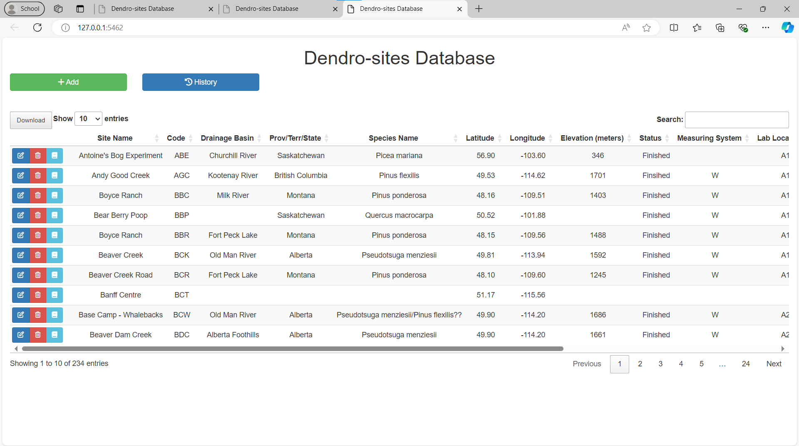
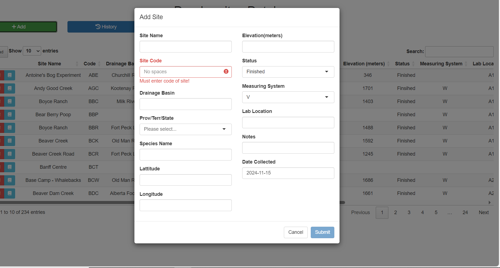

# Tree History and Table Shiny App

## Overview

The Tree History and Table Shiny App is designed to display and manage tree data, including version history and site-specific information. The app provides an interactive interface for viewing, adding, and editing tree data.

## Features

- Display tree data in an interactive data table
- View the version history of tree data
- Add, edit, and delete tree records
- Filter data based on specific criteria
- Access Readme files stored in folders on the NAS

## Installation

This app is hosted in docker containers located on the NAS and can be accessed from the NAS by clicking on the icon labeled db_interface

The basic interface shows the rendered data table with buttons for adding sites and viewing the history of changes. The buttons in the first column allow a user to edit, delete, and view the Read Me for the individual sites.

Users can select the button to add the site which will display this modal allowing the user to fill out key data like name, location, basin, etc. This will also force the user to select a site code which must be unique in order for the user to be able to submit this site to the database. This maintains database integrity by removing the chance of having identical site codes

